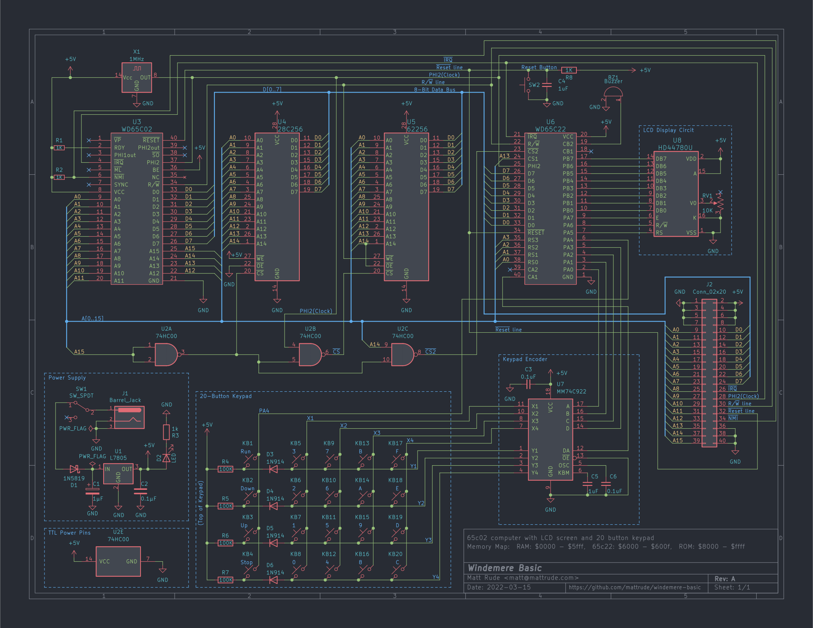
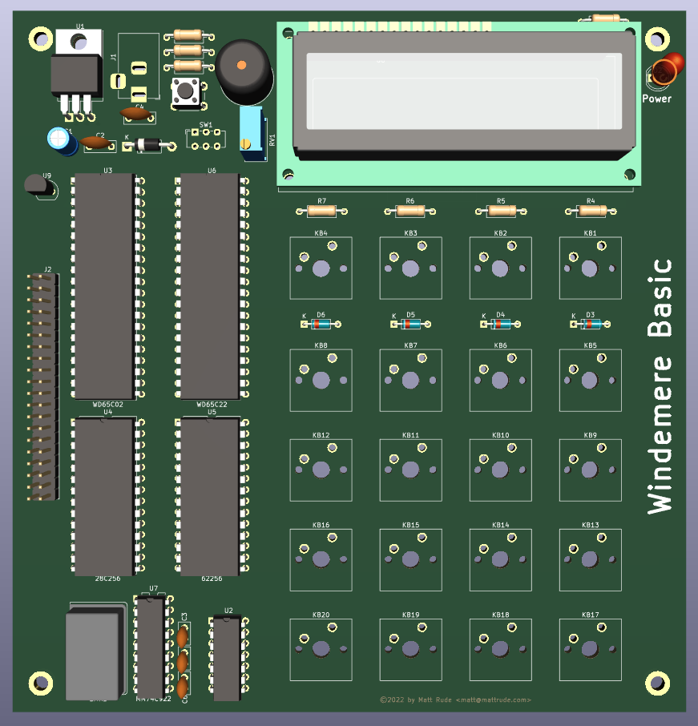

# Windemere Basic 6502 Computer

## About

## Required Tools/Software

### Compiling from source
This source file expects the use of the vasm compiler found at: http://sun.hasenbraten.de/vasm/

To compile this code, run a command similer to:

    vasm6502_oldstyle -c02 -dotdir -Fbin main.asm -o main.bin

## System Images

