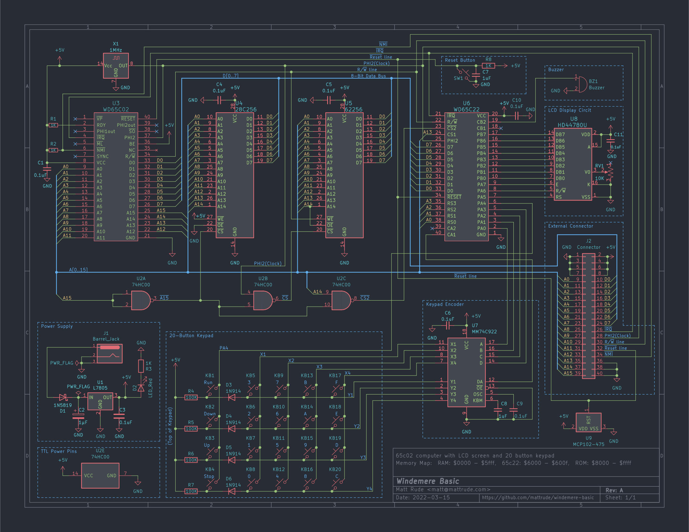
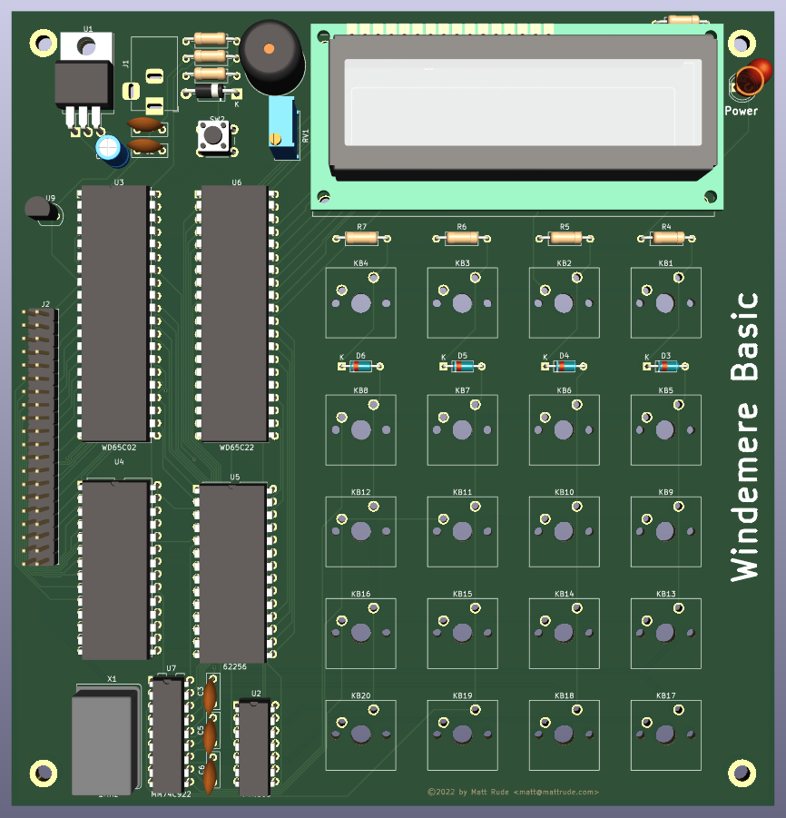

# Windemere Basic 6502 Computer

This is a proof of concept project to build a MOS 6502 computer from scratch. 

## About

                 ┌───────────────────────────┐
                 │    WD65C02 Memory Map     │
                 ├───────┬───────────────────┤
                 │ $0000 │                   │
                 │       │   Zero Page RAM   │
                 │ $00ff │                   │
                 ├───────┼───────────────────┤
                 │ $0100 │///////////////////│
                 │       │////// Stack //////│
                 │ $01ff │///////////////////│
                 ├───────┼───────────────────┤
                 │ $0200 │                   │
                 │       │        RAM        │
                 │ $5fff │                   │
                 ├───────┼───────────────────┤
                 │ $6000 │                   │
                 │       │    W65C22S VIA    │
                 │ $600f │                   │
                 ├───────┼───────────────────┤
                 │ $6010 │                   │
                 │       │    (Not Used)     │
                 │ $7fff │                   │
                 ├───────┼───────────────────┤
                 │ $8000 │                   │
                 │       │        ROM        │
                 │ $ffff │                   │
                 └───────┴───────────────────┘

     ┌────────────────────────────────────────────────────────┐
     │                 Zero Page RAM Locations                │
     ├────────────────────────────────────────────────────────┤
     │ 0000: -- -- -- -- -- -- -- --  -- -- -- -- -- -- -- -- │
     │ 0010: -- -- -- -- -- -- -- --  -- -- -- -- -- -- -- -- │
     │ 0020: -- -- -- -- -- -- -- --  -- -- -- -- -- -- -- -- │
     │ 0030: -- -- -- -- -- -- -- --  -- -- -- -- -- -- -- -- │
     │ 0040: -- -- -- -- -- -- -- --  -- -- -- -- -- -- -- -- │
     │ 0050: -- -- -- -- -- -- -- --  -- -- -- -- -- -- -- -- │
     │ 0060: -- -- -- -- -- -- -- --  -- -- -- -- -- -- -- -- │
     │ 0070: -- -- -- -- -- -- -- --  -- -- -- -- -- -- -- -- │
     │ 0080: -- -- -- -- -- -- -- --  -- -- -- -- -- -- -- -- │
     │ 0090: -- -- -- -- -- -- -- --  -- -- -- -- -- -- -- -- │
     │ 00a0: -- -- -- -- -- -- -- --  -- -- -- -- -- -- -- -- │
     │ 00b0: -- -- -- -- -- -- -- --  -- -- -- -- -- -- -- -- │
     │ 00c0: -- -- -- -- -- -- -- --  -- -- -- -- -- -- -- -- │
     │ 00d0: -- -- -- -- -- -- -- --  -- -- -- -- -- -- -- -- │
     │ 00e0: -- -- -- -- -- -- -- --  -- -- -- -- -- -- -- -- │
     │ 00f0: 00 00 00 00 00 00 00 00  -- -- -- -- -- -- -- -- │
     └────────────────────────────────────────────────────────┘

## Required Tools/Software

### Compiling from source
This source file expects the use of the vasm compiler found at: http://sun.hasenbraten.de/vasm/

To compile this code, run a command similer to:

    vasm6502_oldstyle -c02 -dotdir -Fbin main.asm -o main.bin

## System Images

